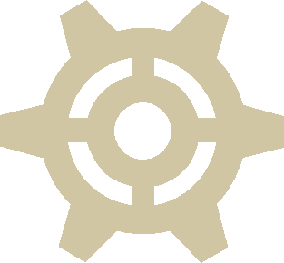
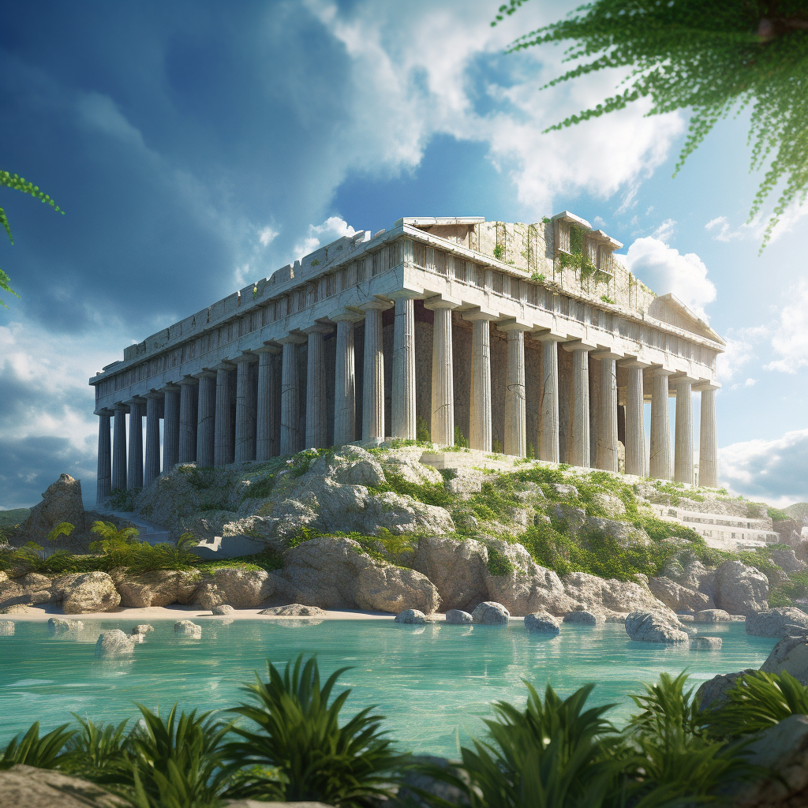
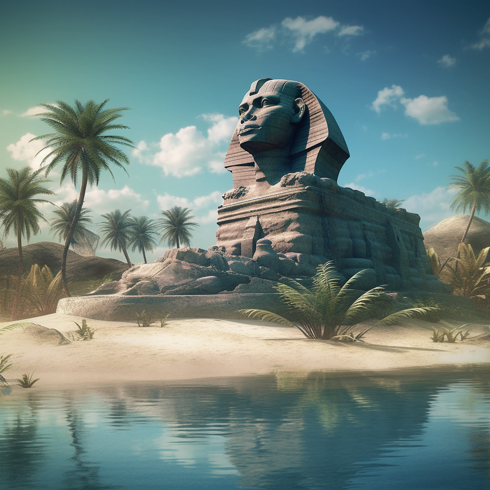
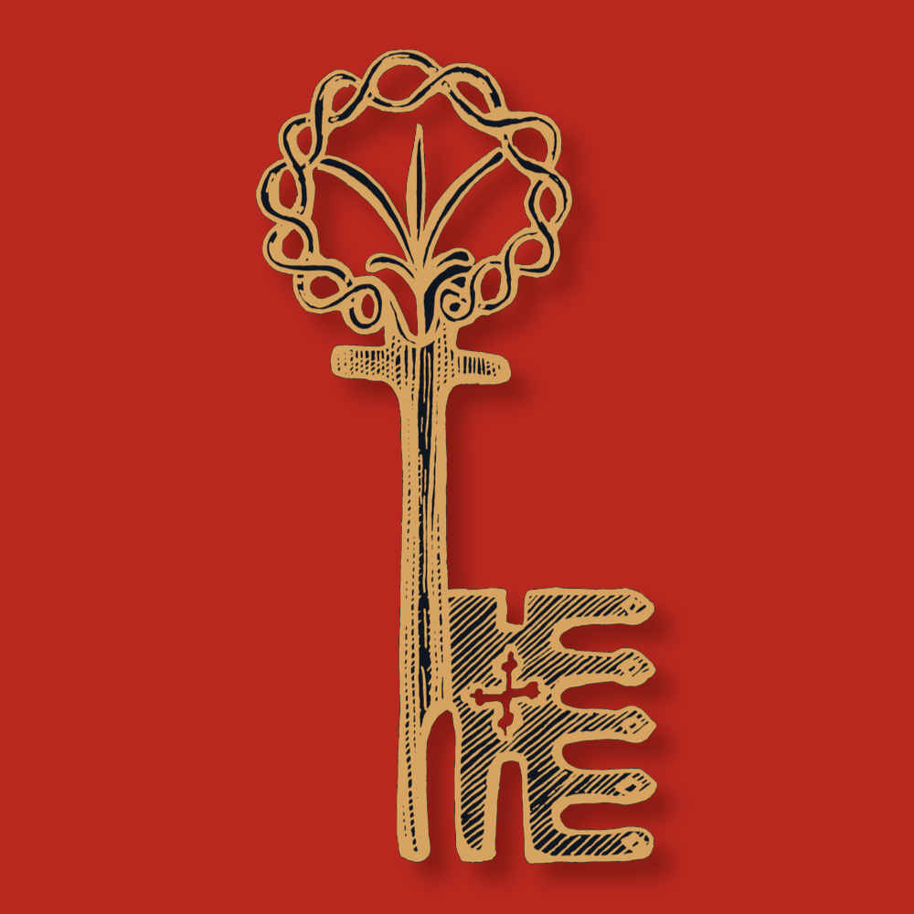
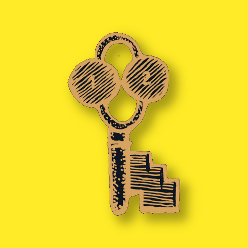
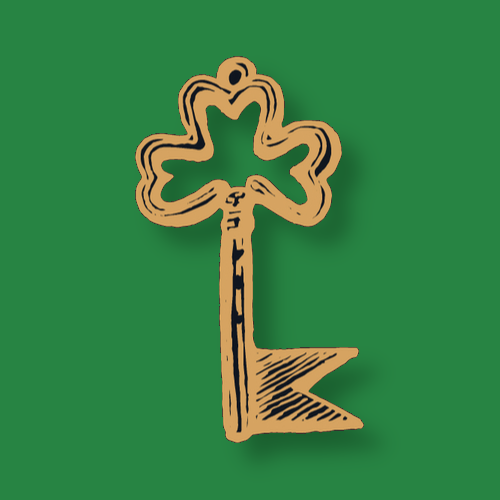
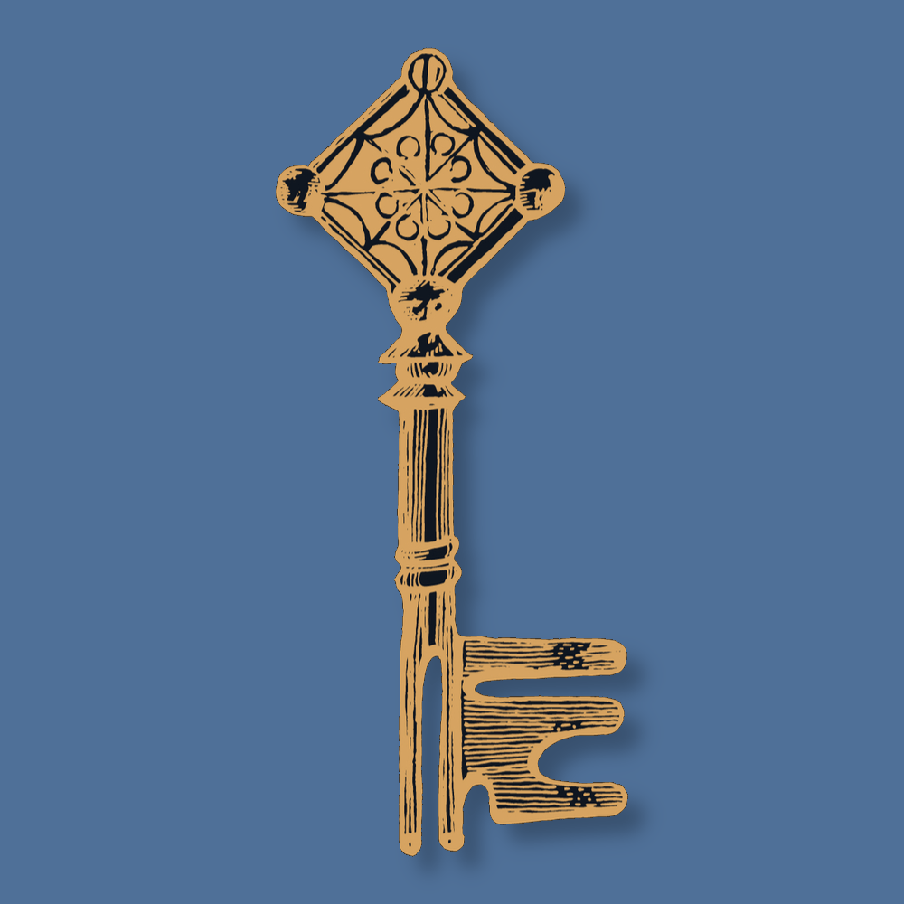
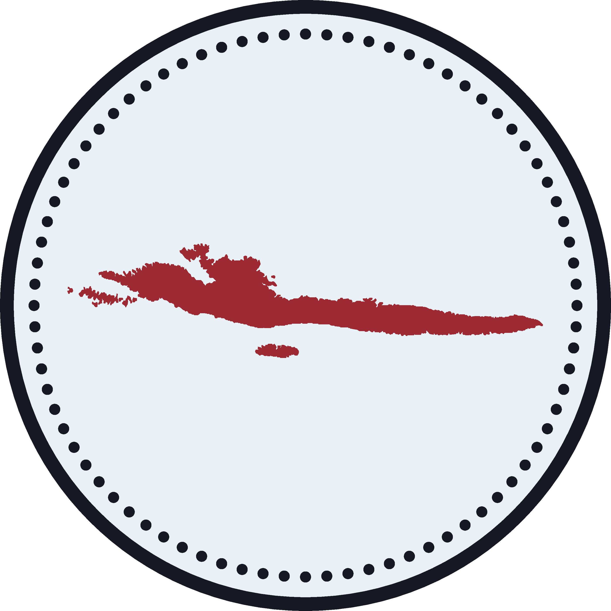
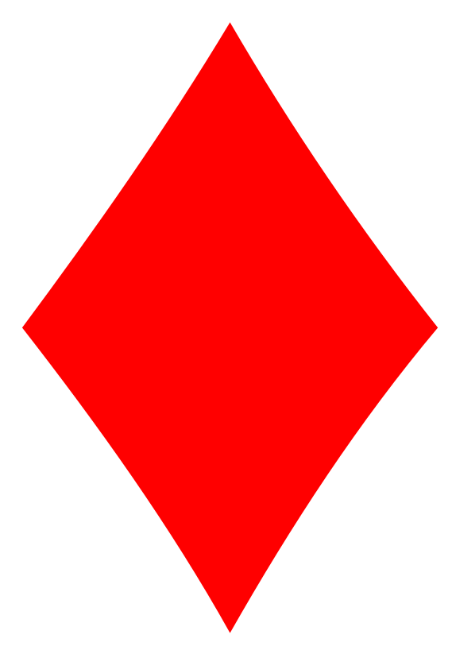

### [🥚](https://xn--wr9h.ws) [**nf/nth**](https://nfnth.com) *new foundations*

... is a privately-held company, located in **Seattle, Washington** at [19500 130th AV NE, Woodinville, WA 98072](https://blue.kingcounty.com/Assessor/eRealProperty/Dashboard.aspx?ParcelNbr=1428900123) in the **Wedge**, diagonal to **Woodin** elementary, view the founder's [**Wellfound** profile](https://wellfound.com/u/urland).

 

#### Projects

Build  [**UR**.Land map](https://ur.land) with [🪨](https://xn--g19h.ws) [**OCUR**.app](https://ocur.app), see the guided tour at  [**iOCUR**.com](https://iocur.com).

Hold  [**OpenSea** deed domain](https://opensea.io/urland) to keep virtual space in  [**UR**.Land](https://ur.land).

 

Install  [**MetaMask** wallet](https://metamask.io) to trade the  [**OCUR**.io token](https://ocur.io), now available on  [**Uniswap**](https://app.uniswap.org/#/tokens/ethereum/0xccab679860b1017589239bceeeabe5cd45965afc) and/or  [**SushiSwap**](https://www.sushi.com/swap).

 

#### Items

- **physical** 
  - go to [**nfnth**.com](https://nfnth.com) and select  (*top-right*)
- **digital** 
  - go to [**nfnth**.com](https://nfnth.com) and select  (*top-left*)
  - visit  [OpenSea](https://opensea.io/urland)
- **ads**
  - **print** and/or **brand** - open the  [**1950**.app](https://1950.app)
  - **brand only** - become a [**GitHub** sponsor](https://github.com/sponsors/nfnth)

 

#### Sponsors

No sponsors yet, become a [**GitHub** sponsor](https://github.com/sponsors/nfnth) now.

 

#### Previews

Play  [**Dralun**.com](https://dralun.com), a Western-themed card game.
