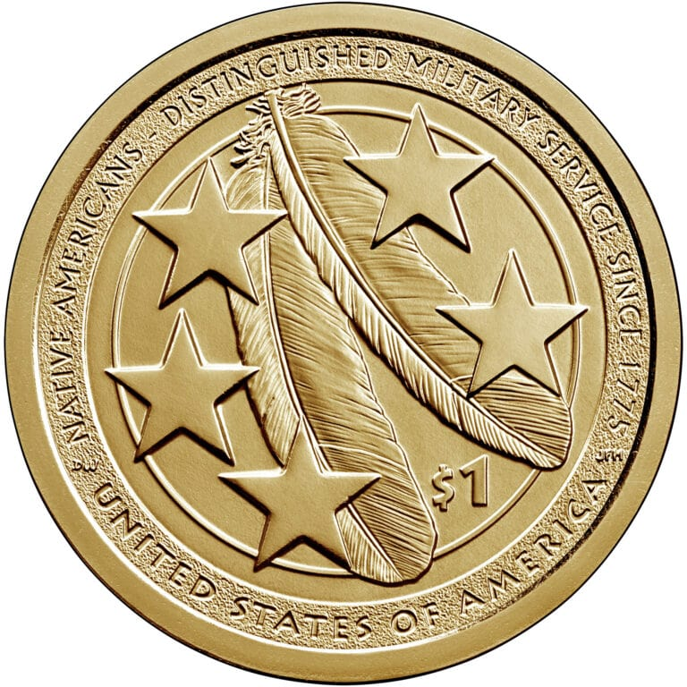

### home of [Nf·Nth](https://github.com/nfnth)

[🙂🙂](https://xn--938ha.ws) 
[👓👓](http://xn--4p8ha.ws) 
[🧤🧤](http://xn--uv9ha.ws) 
[👖👖](http://xn--7p8ha.ws) 
[🧦🧦](http://xn--wv9ha.ws) 
[👟👟](http://xn--hq8ha.ws)

The **[DRALUN](https://dralun.com)** project is used to help facilitate the historical guide (and game) to geocache and survey in the United States (and North America), to include:

- [🌳🌳](https://xn--wh8ha.ws) **[UR.Land](https://ur.land)** *app*
- [📚📚](https://xn--zt8ha.ws) **[mattdown.com](https://mattdown.com)** *script*
- [🏳🏴](https://xn--en8hc.ws) [🏳🏳](https://xn--en8ha.ws) **[ocur.io](https://ocur.io)** [🏴🏳](https://xn--en8hb.ws) [🏴🏴](https://xn--fn8ha.ws) *os*

&nbsp;&nbsp;&nbsp;&nbsp;

For **support**, [use GitHub issues](https://github.com/nfnth/nfnth/issues), to **donate** and/or **advertise** below, [sponsor **NfNth**](https://github.com/sponsors/nfnth). [Donate to Ukraine!](https://engine.presearch.org/search?q=donate+to+ukraine) and/or Zion/United Methodist with [change.org](https://www.change.org/).

Licensed as **NfNth Corp** in the State of Washington, [19500 130th AV NE, Woodinville, WA 98072](https://www.google.com/maps/place/19500+130th+Ave+NE,+Woodinville,+WA+98072/@47.7479925,-122.1874976,14.79z/data=!4m8!1m2!2m1!1surland!3m4!1s0x54900e91e7d1bbd7:0xc04ec07789786761!8m2!3d47.7690595!4d-122.1662039)

[corp](https://ccfs.sos.wa.gov/#/Dashboard) · [license](https://secure.dor.wa.gov/) · [copyright](https://eco.copyright.gov) · [trademark](https://www.uspto.gov/) · [tax](https://blue.kingcounty.com/Assessor/eRealProperty/Dashboard.aspx?ParcelNbr=1428900123) *5% rule (FINRA)*

#### Affiliates

Runs on [Linode](https://cloud.linode.com). Ships with [USPS](https://www.usps.com/business/web-tools-apis/documentation-updates.htm). Crypto uses [gate.io](https://gate.io) with [ETH](https://geth.ethereum.org/downloads/) and Presearch

**AKAM** **INTL** **GOOG** with **COIN** **STRIPE** **VISA** **CHASE** and **GE** **GD** **GM** **KR** *(Canon, AirBNB)*

[C-SPAN](https://www.c-span.org) · [BBC](http://feeds.bbci.co.uk/news/rss.xml) · [Gutenberg](http://www.gutenberg.org) · [Wikipedia](https://www.wikipedia.org/wiki/Special:Random) with [BH](https://www.bhphotovideo.com/) · [AceHardware](https://www.acehardware.com/) · [NorthernTool](https://www.northerntool.com/) · [MPC](https://www.makeplayingcards.com)
