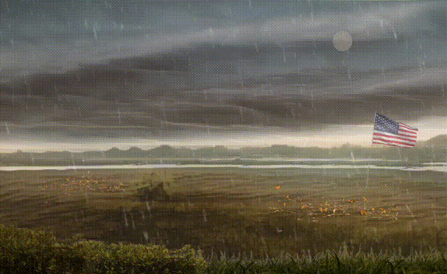

### [🥚](https://xn--wr9h.ws) [nf/nth](https://nfnth.com) (new foundations)

 

Build a  [**UR**.Land map](https://ur.land) and post **content** to [**OCUR**.app](https://ocur.app), see the **tutorial** at [**iOCUR**.com](https://iocur.com).

Hold an  [**OpenSea** deed domain](https://opensea.io/urland) to increase **profile** rank.

Install the  [**MetaMask** wallet](https://metamask.io) to **trade** the [**OCUR**.io token](https://ocur.io), now available on  [**Uniswap**](https://app.uniswap.org/#/tokens/ethereum/0xccab679860b1017589239bceeeabe5cd45965afc) and/or  [**SushiSwap**](https://www.sushi.com/swap).

To display **ads**, select either,

- For **print** and/or **digital**, use the [**1950**.app](https://1950.app)
- For **digital only**, become a [**GitHub** sponsor](https://github.com/sponsors/nfnth)

 

[**nf/nth**](https://nfnth.com) is a privately-held company, located in Washington state, at [19500 130th AV NE, Woodinville, WA 98072](https://blue.kingcounty.com/Assessor/eRealProperty/Dashboard.aspx?ParcelNbr=1428900123) 

... headquartered in the **Wedge**, diagonal to **Woodin** elementary

View founder's profile at [**Wellfound**](https://wellfound.com/u/urland).

